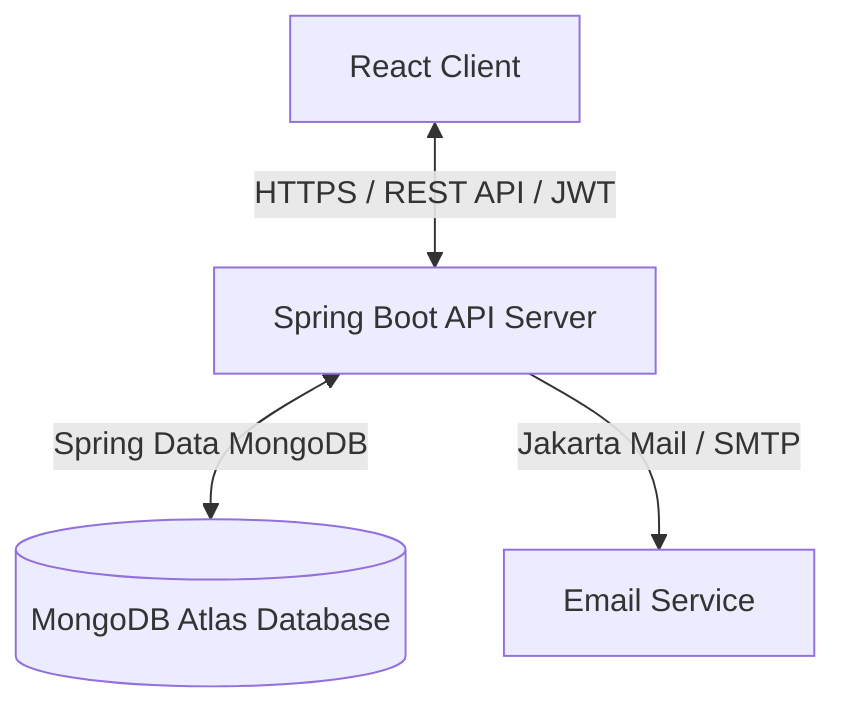

# Architecture Overview

The Turf Booking System uses a decoupled Client-Server architecture.

## System Components

1. **Frontend (React Client)**:
   - Manages state, views, and routing via `React Router`.
   - Utilizes a central Axios instance configured with CORS credentials support to communicate with the REST API.
   - Preserves state securely using tab-level `sessionStorage`.

2. **Backend (Spring Boot API Server)**:
   - Configured with stateless security rules (Spring Security + JWT filter).
   - Validates client JWT headers on protected paths before allowing operations on bookings or profile updates.
   - Prevents booking conflicts inside the reservation controllers.

3. **Database (MongoDB Atlas)**:
   - Cloud-native document storage.
   - Houses `users`, `bookings`, and `turfs` collections.
